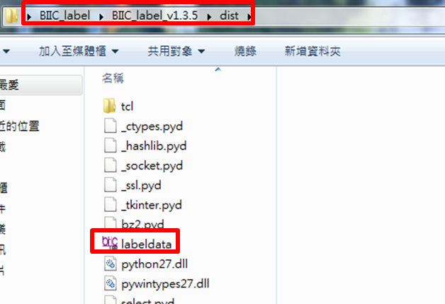
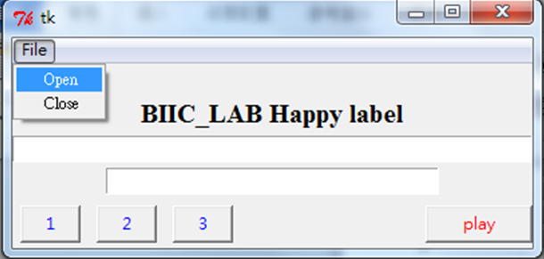
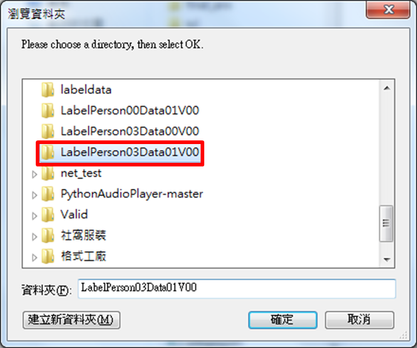
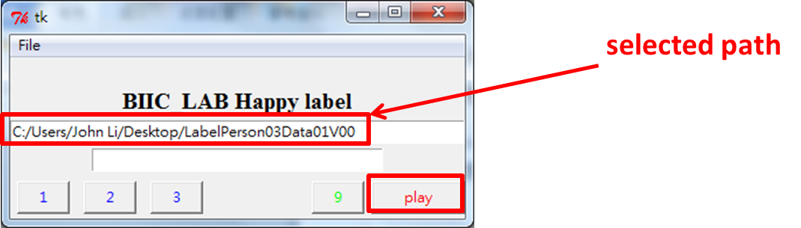
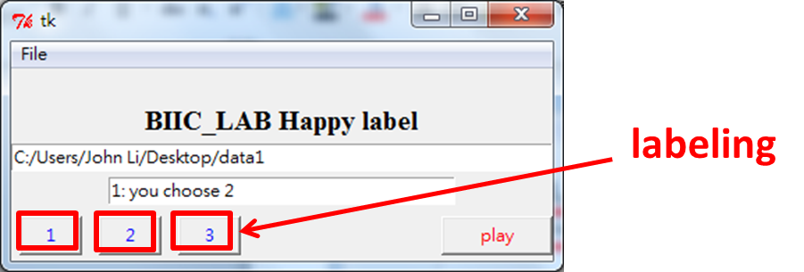
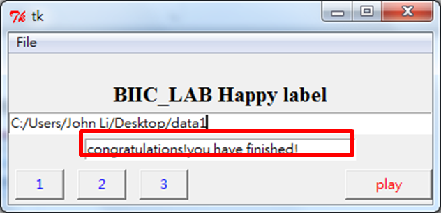
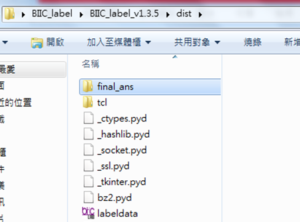

# tools Readme
This is a simple GUI program for labeling task. 
The original labeling objective is for an experiment which attemps to understand whether the speech context in wav files evoke resonance to the subjects.
It depends on the feeling once the subject heard the speech context.
The labels with 1 to 3 represent negative, neutral and positive respectively.
Each wav-file directory comprise about 10 minues long wav files in total.
Completing a directory would need a 10 minues break for the next 10 minutes labeling task.

The program is completed in python2.7 and wrapped to exe file.

* directory BIIC_label --> dist --> labeldata.exe

* With the GUI open, click the file and choose open.

* It is available to select the directory which containing wav files.

* Click 'play' to start labeling.

* Repeat the following steps until the label tasks finished.
1. Click play --> listen to the wav  
2. Click play again if it is necessary to listen to it again.
3. Choose 1,2,3 with the button. After choosing any of them, the chosen one will be showed.

4. Once the label is chosen for the wav file, the next wav file will be played.
5. If all the wav files in the directory is labeled, you will be informed.

* BIIC_lab --> dist --> final_ans
All the labeled data will be recorded and saved in the 'final_ans' directory.

* If there is any bug, please tell me, thank you.
